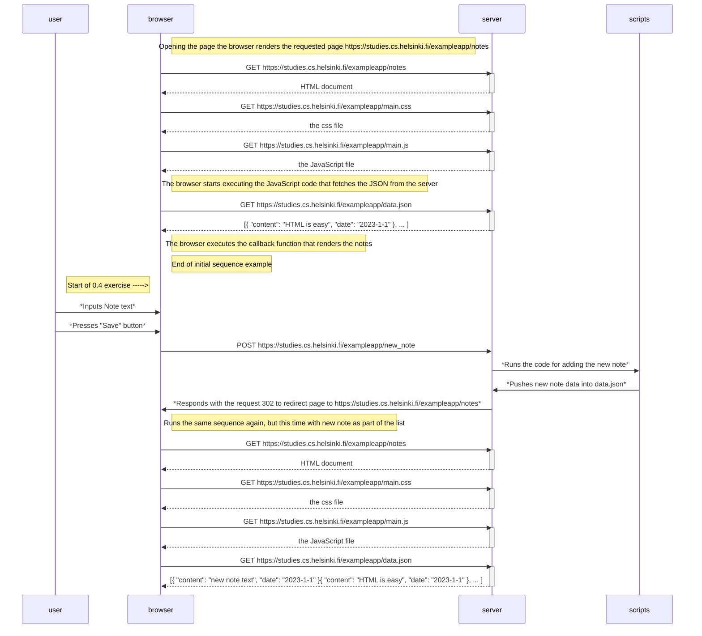

```mermaid
sequenceDiagram
    participant user
    participant browser
    participant server
    participant scripts

    Note right of browser :Opening the page the browser renders the requested page https://studies.cs.helsinki.fi/exampleapp/notes

    browser->>server: GET https://studies.cs.helsinki.fi/exampleapp/notes
    activate server
    server-->>browser: HTML document
    deactivate server

    browser->>server: GET https://studies.cs.helsinki.fi/exampleapp/main.css
    activate server
    server-->>browser: the css file
    deactivate server

    browser->>server: GET https://studies.cs.helsinki.fi/exampleapp/main.js
    activate server
    server-->>browser: the JavaScript file
    deactivate server

    Note right of browser: The browser starts executing the JavaScript code that fetches the JSON from the server

    browser->>server: GET https://studies.cs.helsinki.fi/exampleapp/data.json
    activate server
    server-->>browser: [{ "content": "HTML is easy", "date": "2023-1-1" }, ... ]
    deactivate server

    Note right of browser: The browser executes the callback function that renders the notes
    Note right of browser: End of initial sequence example
    Note right of user: Start of 0.4 exercise ----->

    user->>browser: *Inputs Note text*
    user->>browser: *Presses "Save" button*

    browser->>server: POST https://studies.cs.helsinki.fi/exampleapp/new_note
    server->>scripts: *Runs the code for adding the new note*
    scripts->>server: *Pushes new note data into data.json*
    server->>browser: *Responds with the request 302 to redirect page to https://studies.cs.helsinki.fi/exampleapp/notes*

    Note right of browser: Runs the same sequence again, but this time with new note as part of the list
    browser->>server: GET https://studies.cs.helsinki.fi/exampleapp/notes
    activate server
    server-->>browser: HTML document
    deactivate server

    browser->>server: GET https://studies.cs.helsinki.fi/exampleapp/main.css
    activate server
    server-->>browser: the css file
    deactivate server

    browser->>server: GET https://studies.cs.helsinki.fi/exampleapp/main.js
    activate server
    server-->>browser: the JavaScript file
    deactivate server

    browser->>server: GET https://studies.cs.helsinki.fi/exampleapp/data.json
    activate server
    server-->>browser: [{ "content": "new note text", "date": "2023-1-1" }{ "content": "HTML is easy", "date": "2023-1-1" }, ... ]
    deactivate server
    


```