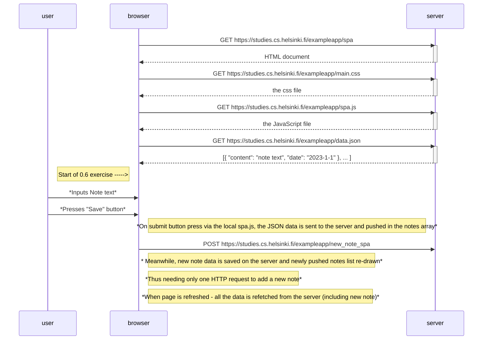

```mermaid
sequenceDiagram
    participant user
    participant browser
    participant server

    browser->>server: GET https://studies.cs.helsinki.fi/exampleapp/spa
    activate server
    server-->>browser: HTML document
    deactivate server

    browser->>server: GET https://studies.cs.helsinki.fi/exampleapp/main.css
    activate server
    server-->>browser: the css file
    deactivate server

    browser->>server: GET https://studies.cs.helsinki.fi/exampleapp/spa.js
    activate server
    server-->>browser: the JavaScript file
    deactivate server

    browser->>server: GET https://studies.cs.helsinki.fi/exampleapp/data.json
    activate server
    server-->>browser: [{ "content": "note text", "date": "2023-1-1" }, ... ]
    deactivate server
    

    Note right of user: Start of 0.6 exercise ----->
    user->>browser: *Inputs Note text*
    user->>browser: *Presses "Save" button*
    Note right of browser: *On submit button press via the local spa.js, the JSON data is sent to the server and pushed in the notes array*
    browser->>server: POST https://studies.cs.helsinki.fi/exampleapp/new_note_spa
    Note right of browser: * Meanwhile, new note data is saved on the server and newly pushed notes list re-drawn*
    Note right of browser: *Thus needing only one HTTP request to add a new note*
    Note right of browser: *When page is refreshed - all the data is refetched from the server (including new note)*
    

```